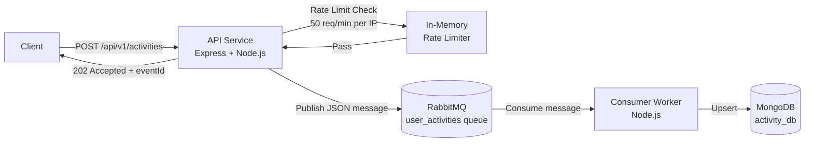

# Architecture

## System Overview



---

## Components

### API Service (`./api`)

| Responsibility | Implementation |
|---|---|
| HTTP server | Express 4.x |
| Input validation | Custom validator in controller |
| Rate limiting | In-memory Map (fixed-window) |
| Message publishing | amqplib `sendToQueue` |
| Health check | `GET /health` |

Key design choices:
- **`trust proxy: 1`** ensures the real client IP is extracted from `X-Forwarded-For` when running behind Docker NAT or a reverse proxy.
- **Non-blocking startup**: RabbitMQ connection is initiated asynchronously so the HTTP server starts immediately even if the broker is briefly slow.

### Consumer Worker (`./consumer`)

| Responsibility | Implementation |
|---|---|
| Queue consumer | amqplib `channel.consume` |
| Data persistence | Mongoose `findOneAndUpdate` upsert |
| Acknowledgment | Manual ACK only after successful DB write |
| Error handling | NACK + requeue (transient) / NACK + discard (malformed) |

Key design choices:
- **Prefetch(10)**: Limits unacknowledged messages per worker to prevent memory exhaustion under load.
- **Idempotent upserts**: Using `$setOnInsert` + unique `id` index ensures redelivered messages are silently ignored with no duplicate writes.
- **Poison-message prevention**: JSON parse errors and missing-field errors result in a `nack(false)` (no requeue) to avoid infinite processing loops.

### RabbitMQ

- Queue: `user_activities`
- Type: Classic durable queue
- Messages: Persistent (`deliveryMode: 2`)
- Management UI: http://localhost:15672 (guest/guest)

### MongoDB

- Database: `activity_db`
- Collection: `activities`
- Unique index on `id` field (prevents duplicate event storage)

---

## Data Flow

```
1. Client sends POST /api/v1/activities with JSON body
2. rateLimiter middleware → checks IP counter (Map)
3. activityController validates all required fields
4. UUID is generated for the event (eventId)
5. rabbitmq.publishActivity() sends message to user_activities queue
6. API responds 202 Accepted with eventId
7. Consumer worker receives message from queue
8. activityProcessor.processMessage() parses and validates the message
9. MongoDB upsert (idempotent): Activity.findOneAndUpdate({ id }, $setOnInsert)
10. channel.ack(msg) → RabbitMQ removes the message from the queue
```

---

## Failure Scenarios & Recovery

| Failure | Behaviour |
|---|---|
| RabbitMQ restarts | API retries connection every 5s; consumer reconnects |
| MongoDB restarts | Consumer retries DB connection on startup |
| Consumer crashes mid-processing | Message remains unacked; redelivered to next available consumer |
| Malformed message in queue | `nack(false)` – message is discarded (or routed to DLQ if configured) |
| Rate limit hit | 429 returned immediately; request not forwarded |
| Duplicate message delivery | Upsert with `$setOnInsert` + duplicate key handling — safely ignored |

---

## Scaling Considerations

- **Horizontal API scaling**: The in-memory rate limiter is per-process. For multiple API replicas, replace with Redis-backed solution (e.g., `ioredis` + sliding window).
- **Horizontal Consumer scaling**: Multiple consumer containers can be started — RabbitMQ distributes messages round-robin via the `prefetch` setting.
- **Dead Letter Queue**: Configure `x-dead-letter-exchange` on `user_activities` to capture unprocessable messages for manual inspection.
